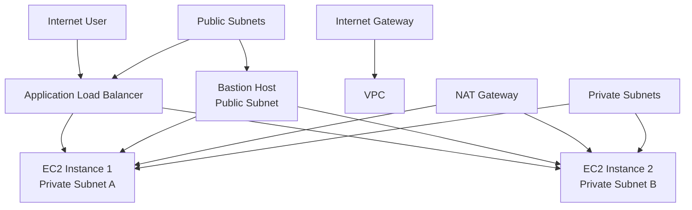
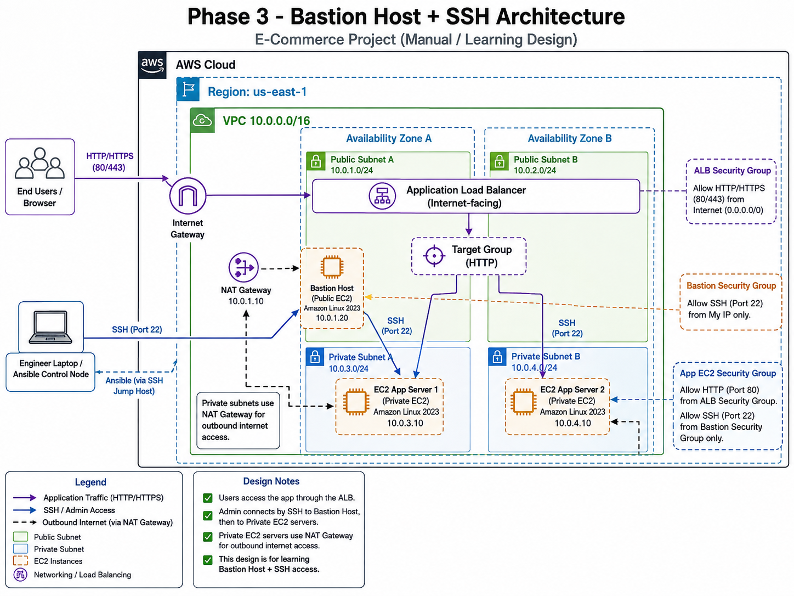

# E-commerce Architecture V1


This project is a learning-focused AWS infrastructure setup built with Terraform and Ansible. It demonstrates a basic multi-tier architecture for an e-commerce environment, covering:

- AWS VPC and networking design
- Public and private subnets
- Internet Gateway and NAT Gateway
- Application Load Balancer
- EC2 instances for web/application workloads
- Bastion host access pattern
- Security group configuration
- Ansible inventory and SSH configuration for remote management

This repository was created as a hands-on project to practice Terraform, AWS networking, and Ansible automation.

## Useful references

- How to add a bastion host to connect to private machines using Ansible: https://drive.google.com/file/d/1DnYjNwbRi6J7KEFECWlrqSvtCcEzjBFt/view?usp=sharing
- How to create custom Docker image and deploy it using an Ansible playbook (video): https://drive.google.com/file/d/1VvqLtnnusEBAGp2TewcE91UmoaO6-OG9/view?usp=sharing

---

## Architecture Overview

The infrastructure includes:

- 1 VPC
- 2 public subnets
- 2 private subnets
- 1 Internet Gateway
- 1 NAT Gateway
- 1 Application Load Balancer
- 2 EC2 instances in private subnets
- 1 bastion host in a public subnet
- Security groups for ALB, bastion, and application instances

The general design is:

- Public-facing traffic reaches the ALB in the public subnets
- Private EC2 instances run in the private subnets
- The bastion host allows secure SSH access into private resources
- Private instances route internet access through the NAT Gateway





---

## Quick Start

### 1. Clone the project

```bash
git clone git@github.com:nawaranasser/e-commerce-arcitechture-v1.git
cd e-commerce-arcitechture-v1
```

### 2. Configure AWS access

Make sure the AWS CLI is installed and configured:

```bash
aws configure --profile terrafrom-2
```

### 3. Initialize Terraform

```bash
terraform init
```

### 4. Preview the infrastructure

```bash
terraform plan
```

### 5. Deploy

```bash
terraform apply
```

### 6. Check outputs

```bash
terraform output
```

### 7. Connect using the bastion host

```bash
chmod 400 deployer-key.pem
ssh -i deployer-key.pem ec2-user@<bastion-public-ip>
```

### 8. Optional: run Ansible

```bash
cd ansible
ansible all -m ping
```

---

## Project Structure

```bash
.
├── ansible/
│   ├── ansible.cfg
│   ├── inventory.yaml
│   └── ssh_config
├── deployer-key.pem
├── ec2.tf
├── internet-gw.tf
├── keypair.tf
├── load-balancer.tf
├── nat-gw.tf
├── output.tf
├── provider.tf
├── route-tables.tf
├── sg.tf
├── subnets.tf
├── userdata.sh
├── variables.tf
├── vpc.tf
├── terraform.tfstate
├── terraform.tfstate.backup
├── .gitignore
└── README.md
```

### Main Terraform files

- `vpc.tf` — creates the VPC
- `subnets.tf` — creates public and private subnets
- `internet-gw.tf` — creates the internet gateway
- `nat-gw.tf` — creates NAT gateway for private instances
- `route-tables.tf` — configures routing tables and associations
- `sg.tf` — defines security groups
- `ec2.tf` — creates EC2 instances
- `load-balancer.tf` — creates ALB, target group, listener, and attachments
- `keypair.tf` — generates SSH key pair and saves private key locally
- `provider.tf` — AWS provider setup
- `variables.tf` — configurable values like region and profile
- `output.tf` — prints useful resource outputs

### Ansible files

- `ansible/inventory.yaml` — inventory for managed hosts
- `ansible/ansible.cfg` — Ansible default configuration
- `ansible/ssh_config` — SSH connection settings for hosts
- `ansible/playbook_docker.yaml` — prepared Ansible playbook to install Docker, configure the environment, and deploy the custom application image

This project also includes a prepared Ansible playbook to install Docker on the target hosts and deploy the custom application image built for the app. The playbook automates the setup needed to run the containerized application in the EC2 environment.

---

## Prerequisites

Before running this project, make sure you have:

1. An AWS account
2. AWS CLI installed and configured
3. Terraform installed
4. Ansible installed
5. SSH client installed on your local machine

### AWS CLI setup

You can configure your AWS profile like this:

```bash
aws configure --profile terrafrom-2
```

The project currently uses the AWS profile name defined in `variables.tf`:

```hcl
variable "profile" {
  default = "terrafrom-2"
}
```

If your AWS profile name is different, update that value in `variables.tf` before applying Terraform.

---

## Terraform Configuration

This project uses the AWS provider:

```hcl
provider "aws" {
  region  = var.region
  profile = var.profile
}
```

### Default values

The default region is set to:

```hcl
region = "us-east-1"
```

The default instance type is:

```hcl
instance_type = "t3.micro"
```

The default AMI is also set in `variables.tf`.

---

## How to Deploy the Infrastructure

From the project root, run:

```bash
terraform init
terraform validate
terraform plan
terraform apply
```

When prompted, confirm the apply action.

After deployment, Terraform will output useful values such as:

- ALB DNS name
- Bastion public IP
- Private IPs of the application machines

You can view outputs again with:

```bash
terraform output
```

---

## Using the Generated SSH Key

Terraform creates a private key file named:

```bash
deployer-key.pem
```

Set the correct permissions before using it:

```bash
chmod 400 deployer-key.pem
```

Then connect to the bastion host using the EC2 public IP from Terraform output:

```bash
ssh -i deployer-key.pem ec2-user@<bastion-public-ip>
```

If your instance uses a different username depending on the AMI, change `ec2-user` accordingly.

---

## Ansible Usage

This project includes a basic Ansible setup in the `ansible/` directory.

### 1. Check the inventory

Open `ansible/inventory.yaml` and update it with your actual host IPs or DNS names after Terraform creates the resources.

Example:

```yaml
bastion_machines:
  hosts:
    bastion:
      ansible_host: <bastion-public-ip>
      ansible_user: ec2-user
      ansible_ssh_private_key_file: ../deployer-key.pem

main_machines:
  hosts:
    machine1:
      ansible_host: <private-ip-1>
      ansible_user: ec2-user
      ansible_ssh_private_key_file: ../deployer-key.pem
    machine2:
      ansible_host: <private-ip-2>
      ansible_user: ec2-user
      ansible_ssh_private_key_file: ../deployer-key.pem
```

### 2. Run a connectivity test

```bash
ansible all -i ansible/inventory.yaml -m ping
```

### 3. Use the provided config

The Ansible config file is already pointing to the inventory:

```ini
[defaults]
inventory = inventory.yaml

[ssh_connection]
ssh_common_args = -F ./ssh_config
```

You can run Ansible from the `ansible/` directory:

```bash
cd ansible
ansible all -m ping
```

---

## Notes About the Current Project State

This project is designed as a learning example and may still require some manual adjustments depending on the environment, such as:

- updating the Ubuntu/AMZN Linux username if the image differs
- editing the Ansible inventory with real IP addresses after deployment
- adjusting the AWS profile name and region settings
- validating the SSH and security group rules for your actual environment

The project is a useful demonstration of how to combine Terraform and Ansible for infrastructure automation and network topology learning.

---

## Clean Up

When you are done testing, remove the deployed AWS resources:

```bash
terraform destroy
```

This will tear down the VPC, EC2 instances, ALB, subnets, gateway, and related network resources.

---

## Learning Objectives

This project helps practice:

- Terraform resource creation and linking
- AWS networking fundamentals
- Load balancer and target group setup
- Secure EC2 access patterns
- VPC, route table, and subnet design
- EC2 provisioning with SSH keys
- Managing infrastructure with Ansible

---

## Recommended Next Improvements

To expand this project further, you could add:

- separate application and database tiers
- RDS database integration
- dynamic Ansible inventory with AWS EC2 plugin
- full web stack deployment using NGINX or Apache
- CI/CD pipeline for infrastructure automation
- remote state management with S3 + DynamoDB
- Terraform modules for reusable infrastructure components

---

## License

This project is intended for educational and learning purposes.

---

## Summary

This repository is a hands-on AWS learning project for understanding how a modern cloud architecture can be built with Terraform and Ansible. It represents a solid foundation for learning infrastructure automation, network design, and cloud-based deployment workflows.
